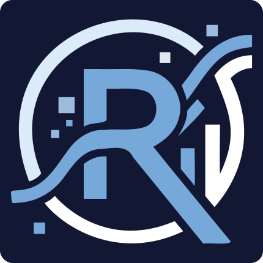

# Curso de R · Universidad El Bosque · Junio 2026

<div align="center">
  
</div>

Materiales del curso introductorio **Maneja, explora y visualiza datos con R**,
ofrecido de forma gratuita en la Universidad El Bosque (Bogotá, Colombia).

- **Sitio web del curso:** `https://<usuario>.github.io/<nombre-repo>/`
- **Fechas:** 3 – 19 de junio de 2026 (miércoles, jueves y viernes)
- **Horario:** 10:00 – 12:00 m.
- **Instructor:** Juan David Leongómez ([jdleongomez.info](https://jdleongomez.info/es/))

## Estructura del repositorio

```
curso-r/
├── index.qmd               # Página principal del sitio
├── programa.qmd            # Objetivos, contenidos y recursos
├── sesiones/
│   ├── s01/ … s09/         # Presentaciones (revealjs) por sesión
├── tareas/
│   ├── tarea1-figura-fea.qmd
│   └── tarea2-paquete-raro.qmd
├── datos/                  # Bases de datos compartidas
├── estilos/
│   ├── slides.scss         # Tema visual de las presentaciones
│   └── sitio.scss          # Tema visual del sitio web
└── .github/workflows/
    └── publish.yml         # GitHub Actions: render + publicar en gh-pages
```

## Reproducibilidad

Las presentaciones se renderizan automáticamente con GitHub Actions cada vez
que se hace push a `main`, y se publican en GitHub Pages.

Para renderizar localmente necesitas [Quarto](https://quarto.org/) y R con los
paquetes listados en `.github/workflows/publish.yml`.

## Licencia

El contenido de este repositorio se distribuye bajo licencia
[CC BY 4.0](https://creativecommons.org/licenses/by/4.0/).
El código se distribuye bajo licencia MIT.
