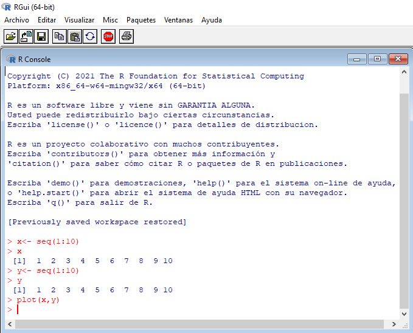
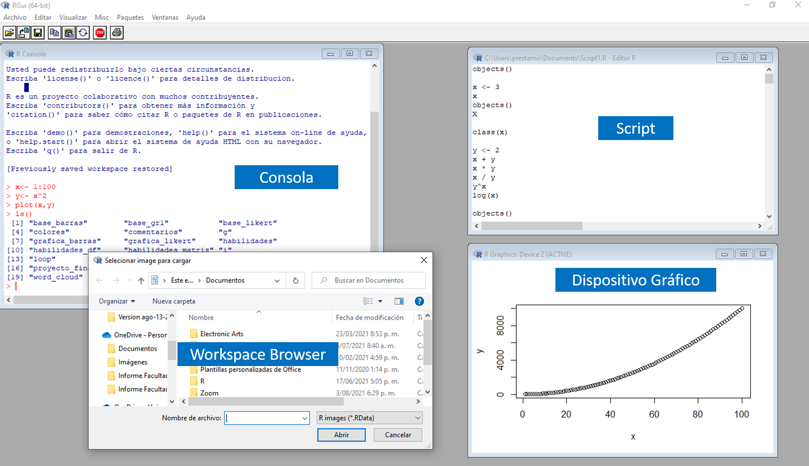
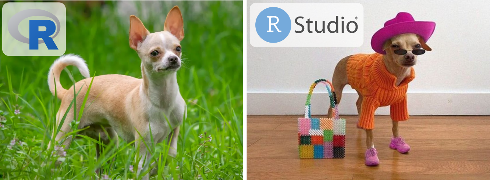
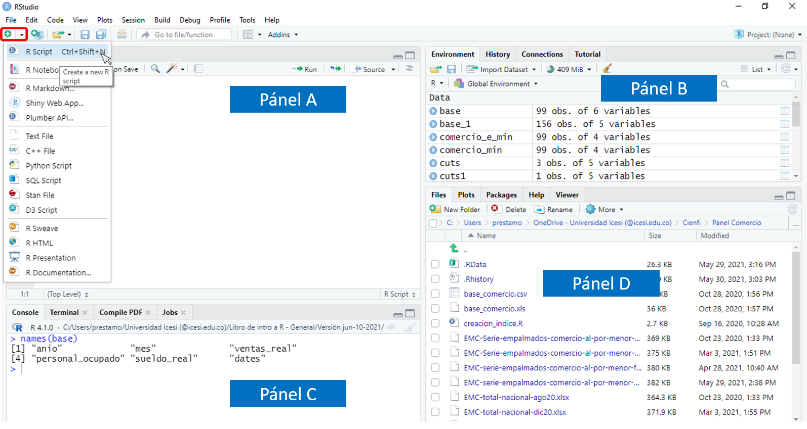
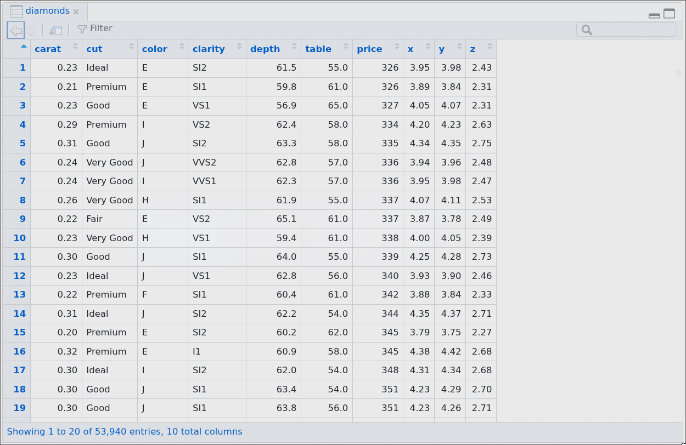

## El sitio del curso {background-color="#121834"}

::::: columns
::: {.column width="50%"}

**Aquí encontrarás todo el material del curso:**

:::{.nonincremental}
- Diapositivas de cada sesión
- Archivos de datos y materiales para las actividades
- Descripciones detalladas de las tareas
:::

Ábrelo ahora en tu computador (o teléfono).
:::

::: {.column width="50%" style="text-align: center;"}
[{width="80%" style="margin-bottom: 0.2em;"}](https://jdleongomez.github.io/curso-r/)

[jdleongomez.github.io/curso-r](https://jdleongomez.github.io/curso-r/){style="color: rgba(255,255,255,0.7); font-size: 0.6em; letter-spacing: 0.03em;"}
:::
:::::


## Agenda

-   ¿Qué es un lenguaje de programación y qué es R?
-   FOSS y ciencia abierta
-   El ecosistema de paquetes: CRAN
-   Scripts y el entorno RStudio
-   Funciones, argumentos y objetos
-   Primera figura con `ggplot2`


##  {background-color="#121834"}

::: parte-num
Parte 1
:::

::: section-title-text
R y los lenguajes de programación
:::


## Programas con interfaz vs. código

::::: columns
::: {.column width="45%"}
**Programa con interfaz gráfica (GUI)**

-   Haces clic en botones y menús
-   Solo puedes hacer lo que el programa ya tiene implementado
-   Cambias un parámetro → repites el proceso completo a mano
-   Difícil de compartir exactamente lo que hiciste

*Ejemplos: Excel, SPSS, GraphPad*
:::

::: {.column width="50%"}
**Lenguaje de programación**

-   Le das instrucciones escritas al computador
-   Puedes hacer (casi) cualquier cosa que el computador pueda hacer
-   Cambias una línea → todo se recalcula solo
-   Puedes compartir exactamente qué hiciste, paso a paso

*Ejemplos: R, Python, Julia*
:::
:::::


## ¿Qué es R?

R es un **lenguaje de programación** diseñado para el análisis estadístico y la visualización de datos.

-   Gratuito y de código abierto (FOSS)
-   Creado en 1993 por Ross Ihaka y Robert Gentleman (Universidad de Auckland)
-   Mantenido por el **R Core Team** y una comunidad global enorme
-   Estándar de facto en muchas disciplinas científicas

::: tip-box
R es un lenguaje completo con acceso a todos los recursos del computador: análisis estadístico, manejo de archivos, conexión a internet, generación de documentos, aplicaciones web, y mucho más.
:::


## FOSS y ciencia abierta

**FOSS** = *Free and Open Source Software*

"Free" en FOSS significa **libre**:

-   Cualquiera puede ver el código fuente y verificar qué hace exactamente
-   Cualquiera puede modificarlo y mejorarlo
-   No depende de una empresa que puede cambiar precios o descontinuarlo

**¿Por qué importa para la ciencia?**

Un análisis en R es reproducible: el script documenta cada paso, y cualquier persona puede replicar tus resultados exactamente.


## CRAN: el repositorio central de paquetes

El verdadero poder de R viene de los **paquetes**: colecciones de funciones creadas por la comunidad que amplían R base.

**CRAN** (*Comprehensive R Archive Network*) es el repositorio oficial:

-   [cran.r-project.org](https://cran.r-project.org)
-   Más de 23 000 paquetes disponibles
-   Cada día se publican o actualizan decenas

::: tip-box
**Demo en vivo:** veamos cuántos paquetes hay hoy y cuáles se actualizaron recientemente.
:::

Muchos paquetes también viven en GitHub y se instalan con herramientas adicionales.


##  {background-color="#121834"}

::: parte-num
Parte 2
:::

::: section-title-text
El entorno de trabajo
:::


## De la terminal al script

Puedes darle instrucciones a R directamente desde la terminal:

::::: columns
::: {.column width="55%"}
```{r}
#| eval: false
2 + 2
```

Funciona, pero al cerrar la terminal pierdes todo lo que escribiste.
:::

::: {.column width="45%"}
{fig-align="center"}
:::
:::::


## De la terminal al script

**Un script** es un archivo de texto plano con extensión `.R`; la extensión indica al sistema operativo que lo abra con R, y cualquier editor puede abrirlo.

``` r
# mi_primer_script.R
2 + 2
sqrt(16)
```

El script es tu **registro permanente** de lo que hiciste. Es la base de la reproducibilidad científica.


## R sin IDE: ventanas sueltas

R funciona solo, pero cada pieza vive en su propia ventana flotante: consola, editor de scripts, gráficas, entorno... Todo disperso.

{fig-align="center" height="420px"}


## RStudio: el entorno de trabajo

R es el motor. RStudio es la carrocería — un **IDE** (*Integrated Development Environment*) que facilita el trabajo: todo lo que ejecutas en RStudio lo procesa R internamente.

-   Editor de scripts con resaltado de sintaxis
-   Consola integrada
-   Visualizador de objetos, gráficas, archivos y ayuda
-   Integración con Quarto/RMarkdown, Git, y más


## RStudio: el entorno de trabajo

R es el motor. RStudio es la carrocería — un **IDE** (*Integrated Development Environment*) que facilita el trabajo: todo lo que ejecutas en RStudio lo procesa R internamente.

{fig-align="center" height="420px"}


## Los paneles de RStudio

::::: columns
::: {.column width="50%"}
{fig-align="center"}
:::

::: {.column width="50%"}
**A. Editor** — escribes y guardas tus scripts

**B. Consola** — R ejecuta el código aquí

**C. Entorno / Historial** — objetos en memoria

**D. Archivos / Gráficas / Ayuda** — explorador y visualizador
:::
:::::


## Configura RStudio {.smaller}

Abre RStudio y ve a **Tools > Global Options**

::::: columns
::: {.column width="50%" .nonincremental}
**General > Basic**

- Desmarca *Restore most recently opened project at startup*
- Desmarca *Restore previously open source documents at startup*
- Desmarca *Restore .RData into workspace at startup*
- En *Save workspace to .RData on exit* selecciona *Never*
- Desmarca *Always save history*

:::

::: {.column width="50%"}
**Code > Editing** {.incremental}

- Marca *Use native pipe operator `|>`*

**Code > Display**

- Marca *Use rainbow parentheses*

**Code > Saving**

- *Default text encoding*: `UTF-8`

**Appearance**

- Escoge el tema y la fuente que más te gusten

:::
:::::


##  {background-color="#121834"}

::: parte-num
Parte 3
:::

::: section-title-text
La sintaxis de R
:::


## Comentarios: `#`

Todo lo que sigue a `#` en una línea es ignorado por R (es un mensaje para humanos).

```r
# Calcular el índice de masa corporal
peso <- 70       # kg
altura <- 1.75   # metros
imc <- peso / altura^2

# Resultado
imc
```

Los comentarios son para ti dentro de seis meses, para tu colaboradora, y para cualquiera que quiera entender o reproducir tu análisis.

::: tip-box
Un buen comentario explica qué hace un código, y/o por qué se hizo algo.

**¡No olvides comentar tus scripts!** Es parte de la buena práctica de programación y ciencia abierta.
:::


## Un script bien organizado y comentado {.smaller}

[⬇ Descargar script](script_ejemplo.R)

```{.r style="max-height: 390px; overflow-y: auto;"}
# =========================================================
# Ejemplo de script organizado y comentado en R
# =========================================================

# ---------------------------------------------------------
# 1. Cargar paquetes necesarios
# ---------------------------------------------------------

library(ggplot2)  # visualización
library(dplyr)    # manipulación de datos

# ---------------------------------------------------------
# 2. Crear un conjunto de datos de ejemplo
# ---------------------------------------------------------

# Fijar semilla para que los resultados sean reproducibles
set.seed(123)

# Crear datos simulados
datos <- tibble(
  participante = 1:20,
  puntaje      = rnorm(20, mean = 75, sd = 10),
  grupo        = rep(c("Control", "Experimental"), each = 10)
)

# ---------------------------------------------------------
# 3. Resumen descriptivo
# ---------------------------------------------------------

# Calcular promedio y desviación estándar de puntajes por grupo
resumen <- datos |>
  group_by(grupo) |>
  summarise(
    promedio   = mean(puntaje),
    desviacion = sd(puntaje)
  )

print(resumen)

# ---------------------------------------------------------
# 4. Visualización
# ---------------------------------------------------------

# Crear gráfico de distribución de puntajes por grupo
colores <- c("Control" = "#225faa", "Experimental" = "#6b1220")

ggplot(datos, aes(x = grupo, y = puntaje, fill = grupo, colour = grupo)) +
  geom_violin(alpha = 0.2, width = 0.7, linewidth = 0.4) +
  geom_boxplot(width = 0.12, alpha = 0.8, outlier.shape = NA, linewidth = 0.6) +
  geom_jitter(width = 0.07, size = 2.8, alpha = 0.75) +
  stat_summary(fun = mean, geom = "point", shape = 23,
               size = 4.5, fill = "white", colour = "grey25") +
  scale_fill_manual(values = colores) +
  scale_colour_manual(values = colores) +
  labs(
    title    = "Distribución de puntajes por grupo",
    subtitle = "Cada punto = un participante · El rombo señala la media grupal",
    x = NULL, y = "Puntaje", caption = "Datos simulados · set.seed(123)"
  ) +
  theme_minimal(base_size = 14) +
  theme(
    legend.position    = "none",
    panel.grid.major.x = element_blank(),
    panel.grid.minor   = element_blank(),
    plot.title         = element_text(face = "bold", size = 16),
    plot.subtitle      = element_text(colour = "grey50", size = 11),
    axis.text.x        = element_text(size = 13, face = "bold")
  )
```


## Funciones y argumentos

Una **función** es como una fábrica: recibe insumos, hace algo con ellos, y produce un resultado.

{fig-align="center" width="50%"}


## Funciones y argumentos

```{=html}
<div style="display:flex; align-items:center; gap:20px; margin:20px 0;">
  <div style="background:#ddeaf8; border:2px solid #225faa; border-radius:8px; padding:14px 20px; text-align:center; min-width:140px;">
    <div style="font-size:0.7em; color:#666; margin-bottom:4px;">ARGUMENTOS (insumos)</div>
    <div style="font-weight:700; color:#225faa;">material = "cuero"<br>talla = 42<br>color = "azul"</div>
  </div>
  <div style="font-size:2em; color:#225faa;">→</div>
  <div style="background:#121834; border-radius:8px; padding:14px 20px; text-align:center; min-width:140px;">
    <div style="font-size:0.7em; color:#aaa; margin-bottom:4px;">FUNCIÓN</div>
    <div style="font-weight:700; color:#fff; font-family:monospace;">hacer_zapato()</div>
  </div>
  <div style="font-size:2em; color:#225faa;">→</div>
  <div style="background:#ddeaf8; border:2px solid #225faa; border-radius:8px; padding:14px 20px; text-align:center; min-width:140px;">
    <div style="font-size:0.7em; color:#666; margin-bottom:4px;">RESULTADO</div>
    <div style="font-size:2em;">👟</div>
  </div>
</div>
```


## Funciones y argumentos

En R, la sintaxis es siempre:

``` r
nombre_funcion(argumento1 = valor1, argumento2 = valor2)
```

El nombre de la función va **antes del paréntesis**. 

Los argumentos van **dentro del paréntesis**, separados por **comas**.


## Funciones en R

```{r}
# sqrt() calcula la raíz cuadrada - recibe un número
sqrt(144)
```

```{r}
# round() redondea - recibe un número y los decimales deseados
round(3.14159, digits = 2)
```

```{r}
# paste() une texto - recibe los fragmentos y el separador
paste("Hola", "mundo", sep = ", ")
```

::: tip-box
Escribe el nombre de cualquier función seguido de `?` en la consola para ver su documentación: `?round`
:::


## Objetos: la memoria de trabajo de R

Cuando usas `<-` para **asignar**, guardas el resultado en un **objeto**.

```{=html}
<div style="display:flex; gap:20px; margin:16px 0;">
  <div style="flex:1; background:#ddeaf8; border-radius:8px; padding:14px 18px;">
    <div style="font-size:0.75em; color:#225faa; font-weight:700; margin-bottom:6px;">🧠 OBJETOS (RAM)</div>
    <div style="font-size:0.85em; color:#333;">Existen mientras R está abierto.<br>Rápidos de usar.<br>Se pierden al cerrar la sesión.</div>
  </div>
  <div style="flex:1; background:#f5f5f3; border:2px solid #e0e0e0; border-radius:8px; padding:14px 18px;">
    <div style="font-size:0.75em; color:#666; font-weight:700; margin-bottom:6px;">💾 ARCHIVOS (disco)</div>
    <div style="font-size:0.85em; color:#333;">Permanentes.<br>Los lees con funciones como <code>read.csv()</code>.<br>No cambian solos.</div>
  </div>
</div>
```

```{r}
resultado <- sqrt(144) # guardamos, no imprimimos
resultado # ahora sí lo vemos
```

**Reglas para nombres de objetos:** sin espacios, sin acentos, no empezar con número, distingue mayúsculas (`datos` ≠ `Datos`). Convención en tidyverse: `snake_case`.


## Vectores: el tipo de dato básico

`c()` (*combine*) crea **vectores**: secuencias de valores del mismo tipo.

```{r}
# Vector numérico
edades <- c(25, 31, 19, 42)
edades
```

```{r}
# Vector de texto (caracteres entre comillas)
nombres <- c("Ana", "Luis", "Sara", "Pedro")
nombres
```

Todo en R es, en el fondo, un vector.

## Data frames: la base de datos en R

Un **data frame** es una tabla: una colección de vectores de igual longitud.

```{r}
personas <- data.frame(
    nombre = nombres,
    edad   = edades
)

personas
```

Es la estructura más común para datos: filas son observaciones, columnas son variables.

##  {background-color="#121834"}

::: parte-num
Parte 4
:::

::: section-title-text
Primera figura con `ggplot2`
:::


---

## Instalar y cargar ggplot2

`ggplot2` es el paquete que usaremos para crear gráficas. Antes de usarlo hay que instalarlo una sola vez, y cargarlo cada sesión.

```{r}
#| eval: false
# Solo la primera vez (instala en el disco)
install.packages("ggplot2")
```

```{r}
# Cada sesión (carga en memoria)
library(ggplot2)
```

::: tip-box
`install.packages()` es como comprar un libro y ponerlo en el estante. `library()` es como abrirlo y tenerlo en la mesa.
:::


## El conjunto de datos `diamonds`

`diamonds` viene incluido con `ggplot2`. Contiene información de 53 940 diamantes.

```{r}
View(diamonds)
```

{fig-align="center" width="50%"}


## ggplot2: el lienzo

`ggplot()` crea un lienzo. Definimos qué datos usar y qué variables mapear a los ejes con `aes()`.

::::: columns
::: {.column width="45%"}
```{r}
#| eval: false
ggplot(
    data = diamonds,
    mapping = aes(x = carat, y = price)
)
```
:::

::: {.column width="55%"}
```{r}
#| echo: false
ggplot(diamonds, aes(x = carat, y = price))
```
:::
:::::


## + puntos

Añadimos una **capa geométrica** con `geom_point()`.

::::: columns
::: {.column width="45%"}
```{r}
#| eval: false
ggplot(diamonds, aes(x = carat, y = price)) +
    geom_point()
```
:::

::: {.column width="55%"}
```{r}
#| echo: false
ggplot(diamonds, aes(x = carat, y = price)) +
    geom_point()
```
:::
:::::


## + transparencia (`alpha`)

Con tantos puntos hay sobreposición. `alpha` controla la transparencia (0 = invisible, 1 = sólido).

::::: columns
::: {.column width="45%"}
```{r}
#| eval: false
ggplot(diamonds, aes(x = carat, y = price)) +
    geom_point(alpha = 0.05)
```
:::

::: {.column width="55%"}
```{r}
#| echo: false
ggplot(diamonds, aes(x = carat, y = price)) +
    geom_point(alpha = 0.1)
```
:::
:::::


## + color por variable

Mapeamos `colour` a `cut` dentro de `aes()` para colorear por grupo.

::::: columns
::: {.column width="45%"}
```{r}
#| eval: false
ggplot(
    diamonds,
    aes(x = carat, y = price, colour = cut)
) +
    geom_point(alpha = 0.1)
```
:::

::: {.column width="55%"}
```{r}
#| echo: false
ggplot(diamonds, aes(x = carat, y = price, colour = cut)) +
    geom_point(alpha = 0.1)
```
:::
:::::


## + tema

Los temas controlan la apariencia general. `theme_minimal()` es un buen punto de partida.

::::: columns
::: {.column width="45%"}
```{r}
#| eval: false
ggplot(
    diamonds,
    aes(x = carat, y = price, colour = cut)
) +
    geom_point(alpha = 0.1) +
    theme_linedraw()
```
:::

::: {.column width="55%"}
```{r}
#| echo: false
ggplot(diamonds, aes(x = carat, y = price, colour = cut)) +
    geom_point(alpha = 0.1) +
    theme_linedraw()
```
:::
:::::


## + paleta de colores

Viridis tiene tres variantes según el tipo de variable mapeada, y dos funciones según la estética usada.

::::: columns
::: {.column width="45%"}
```{r}
#| eval: false
ggplot(
    diamonds,
    aes(x = carat, y = price, colour = cut)
) +
    geom_point(alpha = 0.1) +
    theme_minimal() +
    scale_colour_viridis_d(option = "magma")
```

::: tip-box
`cut` es **categórica** → `_d` (*discrete*). Usa `scale_colour_*` cuando el mapping es `colour =`, y `scale_fill_*` cuando es `fill =`.
:::

:::

::: {.column width="55%"}
```{r}
#| echo: false
ggplot(diamonds, aes(x = carat, y = price, colour = cut)) +
    geom_point(alpha = 0.1) +
    theme_minimal() +
    scale_colour_viridis_d(option = "magma")
```
:::
:::::


## Viridis: `_d`, `_c` y `_b` {.smaller}

Cuando la variable es **numérica continua**, usa `_c` (gradiente suave) o `_b` (intervalos discretos).

::::: columns
::: {.column width="33%"}
```{r}
#| eval: false
# sin tema ni paleta
ggplot(
    faithfuld,
    aes(waiting, eruptions, fill = density)
) +
    geom_tile()
```

```{r}
#| echo: false
#| fig-height: 7
ggplot(faithfuld, aes(waiting, eruptions, fill = density)) +
    geom_tile() +
    theme_minimal()
```
:::

::: {.column width="33%"}
```{r}
#| eval: false
ggplot(
    faithfuld,
    aes(waiting, eruptions, fill = density)
) +
    geom_tile() +
    scale_fill_viridis_c(option = "plasma")
```

```{r}
#| echo: false
#| fig-height: 7
ggplot(faithfuld, aes(waiting, eruptions, fill = density)) +
    geom_tile() +
    scale_fill_viridis_c(option = "plasma") +
    theme_minimal()
```
:::

::: {.column width="33%"}
```{r}
#| eval: false
ggplot(
    faithfuld,
    aes(waiting, eruptions, fill = density)
) +
    geom_tile() +
    scale_fill_viridis_b(option = "plasma")
```

```{r}
#| echo: false
#| fig-height: 7
ggplot(faithfuld, aes(waiting, eruptions, fill = density)) +
    geom_tile() +
    scale_fill_viridis_b(option = "plasma") +
    theme_minimal()
```
:::
:::::


## + etiquetas con `labs()`

`labs()` controla todos los textos de la figura: título, subtítulo, ejes y leyenda.

::::: columns
::: {.column width="45%"}
```{r}
#| eval: false
ggplot(
    diamonds,
    aes(x = carat, y = price, colour = cut)
) +
    geom_point(alpha = 0.1) +
    theme_minimal() +
    scale_colour_viridis_d(option = "magma") +
    labs(
        title    = "Precio según peso del diamante",
        subtitle = "Color según calidad del corte",
        caption  = "Fuente: conjunto de datos diamonds (ggplot2)",
        x        = "Peso (quilates)",
        y        = "Precio (USD)",
        colour   = "Corte"
    )
```
:::

::: {.column width="55%"}
```{r}
#| echo: false
ggplot(diamonds, aes(x = carat, y = price, colour = cut)) +
    geom_point(alpha = 0.1) +
    theme_minimal() +
    scale_colour_viridis_d(option = "magma") +
    labs(
        title    = "Precio según peso del diamante",
        subtitle = "Color según calidad del corte",
        caption  = "Fuente: conjunto de datos diamonds (ggplot2)",
        x        = "Peso (quilates)",
        y        = "Precio (USD)",
        colour   = "Corte"
    )
```
:::
:::::


##  {background-color="#6b1220" .actividad}

::: actividad-num
Actividad · 10 min
:::

::: actividad-title
Modifica la figura
:::

::: actividad-desc
Partiendo del código que acabamos de ver, cambia al menos dos cosas:

:::: nonincremental
- Las variables en `x` y/o `y` (prueba `depth`, `table`, `carat`, `price`)
- La variable de color (`cut`, `color`, `clarity`)
::::

¿Qué relaciones encuentras?
:::


## ¿Con qué datos seguir practicando?

`ggplot2` y `tidyverse` incluyen varias bases de datos listas para usar:

```{r}
#| eval: false
# Ver todas las bases de datos disponibles en los paquetes cargados
data()

# Algunos interesantes
glimpse(mpg) # autos y consumo de combustible
glimpse(gapminder::gapminder) # esperanza de vida por país y año
```

::: tip-box
Escribe `?mpg`, `?diamonds` o `?[nombre_de_los_datos]` en la consola para ver la descripción completa de cualquier base de datos.
:::


##  {background-color="#121834"}

::: parte-num
Antes de terminar...
:::

::: section-title-text
Quiz rápido
:::


## Quiz · 1 de 5

**R y RStudio son básicamente lo mismo; solo cambia el nombre.**

::: nonincremental
- a) Verdad: RStudio es el nombre oficial de R desde 2011
- b) Verdad: son el mismo programa con dos interfaces
- c) Falso: R es el lenguaje; RStudio es un entorno que facilita trabajar con R
- d) Falso: R fue reemplazado por RStudio en 2015
:::

::: {.fragment}
::: respuesta
✓ **c)** R es el motor (el perro); RStudio es la pinta: un entorno cómodo para escribir y organizar código (sin R no hace nada).<br>
{fig-align="center" height="80px"}
:::
:::


## Quiz · 2 de 5

**¿Qué es `sqrt` en este código?**

```r
sqrt(144)
```

::: nonincremental
- a) Un argumento: es el valor que se le pasa a la operación
- b) Una función: es la instrucción que le damos a R
- c) Un objeto: es un resultado guardado en memoria
- d) Un operador: como `+` o `<-`
:::

::: {.fragment}
::: respuesta
✓ **b)** `sqrt` es una **función**: una instrucción con nombre que recibe insumos y produce un resultado. `144` es su **argumento**.
:::
:::


## Quiz · 3 de 5

**¿Qué es `digits = 2` en este código?**

```r
round(3.14159, digits = 2)
```

::: nonincremental
- a) Una función: calcula el número de decimales
- b) Un objeto: guarda el valor 2 en memoria
- c) Un argumento: le indica a `round()` cuántos decimales conservar
- d) Un operador: asigna 2 a la variable `digits`
:::

::: {.fragment}
::: respuesta
✓ **c)** `digits = 2` es un **argumento**: un parámetro (es este caso con nombre "`digits`") que modifica el comportamiento de la función. `digits` es el nombre del argumento; `2` es su valor.
:::
:::


## Quiz · 4 de 5

**¿Qué hace `<-` en este código?**

```r
resultado <- sqrt(144)
```

::: nonincremental
- a) Compara si `resultado` y `sqrt(144)` son iguales
- b) Imprime el resultado de `sqrt(144)` en pantalla
- c) Define una función nueva llamada `resultado`
- d) Guarda el resultado de `sqrt(144)` en un objeto llamado `resultado`
:::

::: {.fragment}
::: respuesta
✓ **d)** `<-` es el **operador de asignación**: evalúa lo que está a la derecha y guarda el resultado en el objeto nombrado a la izquierda. Después puedes usar `resultado` en cualquier parte del código.
:::
:::


## Quiz · 5 de 5

**¿Qué tipo de cosa es `aes(x = carat, y = price)` aquí?**

```r
ggplot(diamonds, aes(x = carat, y = price))
```

::: nonincremental
- a) Un data frame: contiene los datos de `diamonds`
- b) Una capa geométrica: define cómo se dibujan los puntos
- c) Un argumento de `ggplot()` que a su vez es una función
- d) El nombre del tema visual de la figura
:::

::: {.fragment}
::: respuesta
✓ **c)** `aes()` es una **función** (tiene nombre y paréntesis), pero aquí aparece *dentro* de `ggplot()` como uno de sus **argumentos**. En R, pasar funciones como argumentos de otras funciones es completamente normal ¡y hace que sea poderosísimo!
:::
:::


## A practicar

Antes de la próxima sesión, elige un conjunto de datos de los que vimos (o cualquier otro que encuentres) y crea al menos una figura con `ggplot2`.

Experimenta cambiando:

-   El tipo de geometría (`geom_point`, `geom_jitter`, `geom_col`, `geom_histogram`...)
-   Las variables en `x`, `y`, `colour`, `size`, `shape`
-   El tema (`theme_minimal`, `theme_classic`, `theme_bw`, `theme_dark`...)
-   La paleta de colores
-   Las etiquetas con `labs()`

No importa si la figura no queda perfecta. Lo importante es jugar con el código y ver qué pasa.



