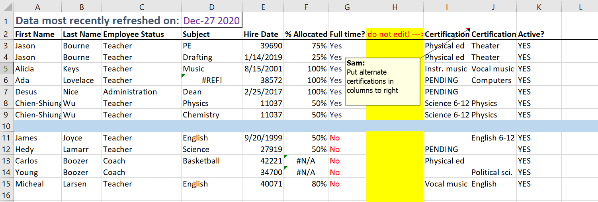
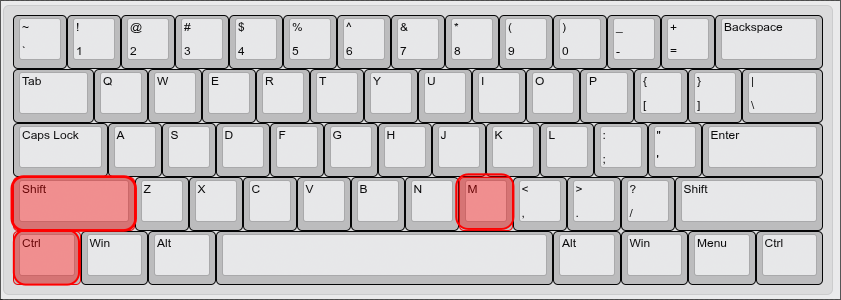
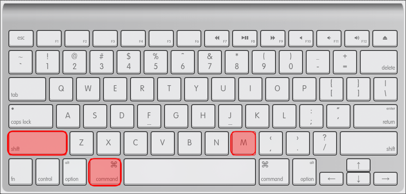

```{r}
#| include: false
library(tidyverse)
library(readxl)
library(palmerpenguins)

pinguinos <- penguins |> drop_na()

encuesta_bruta <- read_excel("datos/encuesta_bruta.xlsx", skip = 2)

encuesta <- encuesta_bruta |>
    select(-nombre, -observaciones, -starts_with("...")) |>
    rename(genero = `Género`) |>
    rename_with(~ tolower(gsub(" ", "_", .)), starts_with("GAD")) |>
    mutate(
        genero = case_when(
            genero %in% c("Mujer", "mujer", "M") ~ "Mujer",
            genero %in% c("Hombre", "hombre", "H") ~ "Hombre",
            .default = genero
        ),
        carrera = case_when(
            tolower(carrera) %in% c("psicología", "psicologia") ~ "Psicología",
            tolower(carrera) == "medicina" ~ "Medicina",
            tolower(carrera) %in% c("enfermería", "enfermeria") ~ "Enfermería",
            .default = carrera
        ),
        ansiedad_total = gad_1 + gad_2 + gad_3 + gad_4 + gad_5 + gad_6 + gad_7,
        nivel_ansiedad = case_when(
            ansiedad_total <= 4 ~ "Mínima",
            ansiedad_total <= 9 ~ "Leve",
            ansiedad_total <= 14 ~ "Moderada",
            ansiedad_total >= 15 ~ "Severa"
        ),
        nivel_ansiedad = factor(nivel_ansiedad,
            levels = c("Mínima", "Leve", "Moderada", "Severa")
        )
    )
```

## Agenda

- Datos sucios: el problema de partida
- Los verbos de dplyr: `select`, `rename`, `filter`, `mutate`, `summarise`, `group_by`
- El problema de combinar verbos sin pipe
- El pipe nativo `|>` (y una nota sobre `%>%`)
- Por qué Excel no es para datos de investigación
- Datos de psicología: limpieza y figuras

---

## {background-color="#121834"}

::: parte-num
Parte 1
:::

::: section-title-text
Datos sucios
:::

---

## La realidad de los datos

En investigación, los datos no llegan limpios. A menudo llegan así:

{fig-align="center" width="80%"}

Esta es una hoja de Excel típica: filas de título, celdas combinadas, columnas con nombres que nadie va a querer escribir en código.

---

## Descargar y cargar los datos {.smaller}

[⬇ Descargar `encuesta_bruta.xlsx`](https://jdleongomez.github.io/curso-r/sesiones/s03/datos/encuesta_bruta.xlsx)

Guarda el archivo en tu computador. Para cargarlo sin necesitar conocer rutas, usa el menú de RStudio:

**Environment → Import Dataset → From Excel...**

::::: columns
::: {.column width="55%"}
1. Navega hasta el archivo y selecciónalo
2. En la vista previa verás que la primera fila es el título del estudio: ajusta **Skip** a `2`
3. Verifica que la vista previa ya muestre las columnas correctas
4. **Copia el código** del recuadro *Code Preview* antes de hacer clic en Import
5. Pégalo en tu script y ejecútalo desde ahí
:::
::: {.column width="45%"}
::: tip-box
El paso más importante es **copiar el código**. Sin eso, la próxima vez que abras RStudio tendrás que repetir todo el proceso. Con el código en el script, basta con ejecutarlo una vez.
:::
:::
:::::

---

## El código que genera RStudio {.smaller}

El código que aparece en *Code Preview* se verá así (con la ruta a tu archivo):

```{r}
#| eval: false
library(readxl)
encuesta_bruta <- read_excel("~/Desktop/encuesta_bruta.xlsx", skip = 2)
```

Pégalo en tu script. Ahora verifiquemos qué llegó:

```{r}
#| eval: false
glimpse(encuesta_bruta)
```

```{r}
#| echo: false
encuesta_bruta <- read_excel("datos/encuesta_bruta.xlsx", skip = 2)
glimpse(encuesta_bruta)
```

180 filas, columnas con nombre. Pero quedan columnas extra al final (`...15`, `...16`, `...17`) por el texto y el cálculo que alguien dejó fuera de la tabla.

---

## ¿Qué necesitamos?

Para dejar `encuesta_bruta` lista para analizar, necesitamos:

- **Eliminar** las columnas fantasma (`...15`, `...16`, `...17`) y las innecesarias (`nombre`, `observaciones`)
- **Renombrar** columnas con espacios o tildes (`Género` → `genero`, `GAD 1` → `gad_1`...)
- **Transformar** columnas: estandarizar categorías inconsistentes ("Mujer" / "mujer" / "M")
- **Crear** columnas nuevas: puntaje total, nivel de ansiedad
- **Resumir** por grupos

Todas esas operaciones las resuelve **dplyr**. Pero primero aprendemos las herramientas.

---

## {background-color="#121834"}

::: parte-num
Parte 2
:::

::: section-title-text
Los verbos de dplyr
:::

---

## dplyr en el ecosistema tidyverse

`dplyr` es parte de `tidyverse` y trabaja en perfecta sintonía con `ggplot2`: ambos esperan datos en formato tabular (filas = observaciones, columnas = variables).

```{r}
library(tidyverse)
```

Sus funciones principales se llaman **verbos**:

| Verbo | Qué hace |
|---|---|
| `select()` | Elige columnas |
| `rename()` | Cambia el nombre de columnas |
| `filter()` | Elige filas según una condición |
| `mutate()` | Crea o sobreescribe columnas |
| `summarise()` | Resume datos en una o pocas filas |
| `group_by()` | Agrupa filas para operar por grupo |

---

## Nuestros datos de práctica

Usaremos `pinguinos` (los pingüinos de Palmer, ya conocidos de la sesión anterior):

```{r}
library(palmerpenguins)
pinguinos <- drop_na(penguins)
glimpse(pinguinos)
```

---

## {background-color="#225faa"}

::: parte-num
Verbo 1
:::

::: section-title-text
`select()` · elegir columnas
:::

---

## `select()`: elegir columnas por nombre

```{r}
select(pinguinos, species, body_mass_g, sex)
```

---

## `select()`: excluir con `-`

```{r}
select(pinguinos, -year, -island)
```

---

## `select()`: patrones de nombre

`starts_with()`, `ends_with()` y `contains()` seleccionan columnas según su nombre:

:::: {.columns}
::: {.column width="50%"}
```{r}
select(pinguinos, species, starts_with("bill"))
```
:::
::: {.column width="50%"}
```{r}
select(pinguinos, species, ends_with("_mm"))
```
:::
::::
---

## `rename()`: renombrar columnas

```{r}
rename(pinguinos, especie = species, masa_g = body_mass_g)
```

La sintaxis es siempre `nuevo_nombre = nombre_actual`.

---

## {background-color="#225faa"}

::: parte-num
Verbo 2
:::

::: section-title-text
`filter()` · elegir filas
:::

---

## `filter()`: filas que cumplen una condición

```{r}
filter(pinguinos, species == "Adelie")
```

::: tip-box
Usa `==` para comparar igualdad (no `=`). Los operadores habituales: `==` igual, `!=` distinto, `>`, `<`, `>=`, `<=`.
:::

---

## `filter()`: varias condiciones con AND

Separar condiciones con `,` equivale a AND (se deben cumplir **todas**):

```{r}
filter(pinguinos, species == "Adelie", body_mass_g > 4000)
```

---

## `filter()`: condiciones con OR

El operador `|` significa OR (basta con que se cumpla **al menos una**):

```{r}
filter(pinguinos, species == "Chinstrap" | body_mass_g > 5500)
```

---

## `filter()`: el operador `%in%` {.smaller}

`%in%` comprueba si un valor pertenece a un conjunto. Es más limpio que escribir varios OR:

```{r}
#| eval: false
# Sin %in%: repetitivo
filter(pinguinos, species == "Adelie" | species == "Chinstrap")
```

Es equivalente a:

```{r}
# Con %in%: más claro
filter(pinguinos, species %in% c("Adelie", "Chinstrap"))
```

::: tip-box
`%in%` devuelve `TRUE` si el valor de la izquierda aparece en algún lugar del vector de la derecha. `!` invierte: `!species %in% c("Adelie", "Chinstrap")` excluye esas dos especies.
:::

---

## {background-color="#6b1220" .actividad}

::: actividad-num
Actividad · 2 min
:::

::: actividad-title
AND vs. OR: ¿quién se incluye?
:::

::: actividad-desc
Considera estos dos filtros sobre `pinguinos`:

```r
filter(pinguinos, sex == "female", body_mass_g > 4500)
filter(pinguinos, sex == "female" | body_mass_g > 4500)
```

**¿Se incluiría una hembra que pesa 4100 g en cada caso?**

¿Y un macho que pesa 5000 g?
:::

---

## {background-color="#225faa"}

::: parte-num
Verbo 3
:::

::: section-title-text
`mutate()` · crear y transformar columnas
:::

---

## `mutate()`: crear una columna nueva

```{r}
mutate(pinguinos, body_mass_kg = body_mass_g / 1000)
```

La nueva columna se añade al final. El data frame original no cambia.

---

## `mutate()`: sobreescribir una columna existente

Si usas el nombre de una columna que ya existe, la sobreescribe:

:::: {.columns}
::: {.column width="65%"}
```{r}
mutate(pinguinos, body_mass_g = body_mass_g / 1000)
```
:::
::: {.column width="35%"}
::: tip-box
Las columnas `body_mass_g` y `body_mass_kg` harían lo mismo aquí. La diferencia es si quieres conservar el valor original con otro nombre o simplemente transformar la columna en su lugar. En el análisis de datos, sobreescribir es útil para estandarizar unidades, convertir tipos o corregir errores de codificación.
:::
:::
::::

---

## `mutate()` + `case_when()`: recodificar

`case_when()` evalúa condiciones de arriba a abajo y asigna el valor de la primera que se cumpla:

```{r}
mutate(
    pinguinos,
    tamano = case_when(
        body_mass_g >= 5000 ~ "Grande",
        body_mass_g >= 3500 ~ "Mediano",
        .default = "Pequeño"
    )
)
```

---

## {background-color="#225faa"}

::: parte-num
Verbos 4 y 5
:::

::: section-title-text
`summarise()` y `group_by()`
:::

---

## `summarise()`: colapsar en un resumen

```{r}
summarise(
    pinguinos,
    masa_media = mean(body_mass_g),
    masa_sd    = sd(body_mass_g),
    n          = n()
)
```

`n()` cuenta el número de filas. Las demás son funciones estadísticas normales.

---

## `group_by()` + `summarise()`: resumen por grupos

`group_by()` divide el data frame en grupos; `summarise()` opera dentro de cada uno. Por ahora, lo hacemos en dos pasos:

:::: {.columns}
::: {.column width="50%"}
```{r}
por_especie <- group_by(pinguinos, species)
summarise(por_especie,
    masa_media = mean(body_mass_g),
    n          = n()
)
```
:::
::: {.column width="50%"}
```{r}
por_esp_sexo <- group_by(pinguinos, species, sex)
summarise(por_esp_sexo,
    masa_media = mean(body_mass_g),
    n          = n()
)
```
:::
::::

---

## `group_by()` + `mutate()`: calcular dentro de grupos

A diferencia de `summarise()`, `mutate()` devuelve una fila por observación original:

```{r}
por_especie <- group_by(pinguinos, species)
mutate(por_especie, masa_vs_especie = body_mass_g - mean(body_mass_g))
```

---

## {background-color="#6b1220" .actividad}

::: actividad-num
Actividad · 8 min
:::

::: actividad-title
Encadenar verbos
:::

::: actividad-desc
Con `pinguinos`, aplica los verbos que conoces y:

:::: nonincremental
1. Filtra solo las observaciones de la isla Dream
2. Añade una columna `masa_kg` (masa en kilogramos)
3. Selecciona solo `species`, `sex`, `flipper_length_mm` y `masa_kg`
::::

¿Qué dificultad aparece al hacerlo en pasos separados?
:::

---

## {background-color="#121834"}

::: parte-num
Parte 3
:::

::: section-title-text
El problema de combinar verbos
:::

---

## Varios pasos, varios objetos

Cuando necesitas aplicar varios verbos, sin pipe tienes que guardar cada paso:

```{r}
paso1 <- select(pinguinos, species, sex, body_mass_g)
paso2 <- filter(paso1, sex == "female")
paso3 <- mutate(paso2, body_mass_kg = body_mass_g / 1000)
paso4 <- group_by(paso3, species)
paso5 <- summarise(paso4, masa_media_kg = mean(body_mass_kg))
paso5
```

El entorno se llena de `paso1`... `paso5`. ¿Cuál es el definitivo?

---

## O todo anidado (leer de adentro hacia afuera)

```{r}
summarise(
    group_by(
        mutate(
            filter(
                select(pinguinos, species, sex, body_mass_g),
                sex == "female"
            ),
            body_mass_kg = body_mass_g / 1000
        ),
        species
    ),
    masa_media_kg = mean(body_mass_kg)
)
```

::: tip-box
El orden de ejecución va de adentro hacia afuera, pero el orden de lectura va de arriba hacia abajo. Una sola coma en el lugar equivocado rompe todo.
:::

---

## {background-color="#121834"}

::: parte-num
Parte 4
:::

::: section-title-text
El pipe `|>`
:::

---

## La solución: el pipe nativo `|>`

El pipe toma el resultado de la izquierda y lo pasa como **primer argumento** de la función de la derecha:

```{r}
#| eval: false
x |> f() # equivale a: f(x)
x |> f(y) # equivale a: f(x, y)
x |>
    f() |>
    g() # equivale a: g(f(x))
```

Con pipe, el código se lee de arriba a abajo, como una secuencia de pasos.

---

## El mismo ejemplo, con pipe

```{r}
pinguinos |>
    select(species, sex, body_mass_g) |>
    filter(sex == "female") |>
    mutate(body_mass_kg = body_mass_g / 1000) |>
    group_by(species) |>
    summarise(masa_media_kg = mean(body_mass_kg))
```

Un solo resultado. Sin objetos intermedios. Se lee como una receta.

---

## Atajo de teclado

En RStudio, el pipe se inserta con:

:::: {.columns}
::: {.column width="50%"}
**Windows / Linux:** `Ctrl + Shift + M`
  
{fig-align="left" height="200px"}
:::
::: {.column width="50%"}
**Mac:** `Cmd + Shift + M`
  
{fig-align="left" height="200px"}
:::
::::

::: tip-box
Verifica que el atajo esté configurado para `|>` y no para `%>%`. Ve a **Tools > Global Options > Code > Editing** y marca "Use native pipe operator `|>`".
:::

---

## El pipe de magrittr: `%>%`

Antes de que R 4.1 (2021) introdujera `|>`, el pipe más usado venía del paquete **magrittr** (parte de tidyverse).

```{r}
#| eval: false
pinguinos %>%
    filter(species == "Adelie") %>%
    summarise(masa_media = mean(body_mass_g))
```

Si ves `%>%` en tutoriales, libros o código de colegas, hace lo mismo que `|>` en la gran mayoría de los casos.

::: tip-box
Hoy se recomienda `|>` por ser nativo (no requiere paquetes adicionales). `%>%` tiene algunas funciones avanzadas para casos muy específicos, pero para el trabajo cotidiano son equivalentes.
:::

---

## Pipe + ggplot2: el pipeline completo

Los datos pasan directamente de dplyr a ggplot2 sin crear objetos intermedios:

::::: columns
::: {.column width="45%"}
```{r}
#| eval: false
pinguinos |>
    filter(species != "Gentoo") |>
    group_by(species, sex) |>
    summarise(masa = mean(body_mass_g)) |>
    ggplot(aes(
        x = species,
        y = masa,
        fill = sex
    )) +
    geom_col(position = "dodge") +
    scale_fill_viridis_d() +
    theme_minimal()
```
:::
::: {.column width="55%"}
```{r}
#| echo: false
pinguinos |>
    filter(species != "Gentoo") |>
    group_by(species, sex) |>
    summarise(masa = mean(body_mass_g)) |>
    ggplot(aes(x = species, y = masa, fill = sex)) +
    geom_col(position = "dodge") +
    scale_fill_viridis_d() +
    labs(x = NULL, y = "Masa corporal media (g)", fill = "Sexo") +
    theme_minimal()
```
:::
:::::

---

## {background-color="#121834"}

::: parte-num
Parte 5
:::

::: section-title-text
Por qué Excel no es para datos de investigación
:::

---

## Excel no es *machine-readable*

Un archivo *machine-readable* (legible por máquina) tiene un formato que un programa puede interpretar directamente, fila por fila, sin que haya ninguna ambigüedad.

Excel no lo garantiza porque:

- Permite mezclar datos, cálculos, gráficos, notas y texto decorativo en la misma hoja
- Una celda puede contener "3,5 kg de masa corporal (valor estimado)" y eso no es un número
- Las celdas combinadas y las filas de títulos extra dañan cualquier estructura tabular
- El formato `.xlsx` almacena colores, fuentes y bordes junto a los datos, haciéndolo pesado y dependiente de un programa propietario

Un CSV o un data frame en R son *machine-readable*: cada columna tiene un tipo fijo y cada fila es una observación.

---

## Más problemas de Excel {.smaller}

::::: columns
::: {.column width="50%"}
**Reproducibilidad**

- Cuando calculas algo en Excel, queda el resultado pero no el proceso
- Cualquier edición a los datos originales es permanente e invisible
- Dos personas haciendo "lo mismo" en Excel pueden obtener resultados distintos

**Escala**

- Maneja mal tablas muy grandes (más de unos cientos de miles de filas)
- Un archivo con muchas fórmulas se vuelve lento e inestable
:::

::: {.column width="50%"}
**Formato propietario**

- Depende de Microsoft para abrirlo correctamente
- Distintas versiones de Excel abren el mismo archivo de forma diferente
- En la próxima sesión veremos formatos abiertos como CSV, que evitan este problema

**Tipos de datos**

- Excel adivina el tipo de cada celda, y a veces se equivoca de forma silenciosa
:::
:::::

---

## El enemigo silencioso: Excel modifica datos {auto-animate=true}

{fig-align="center" width="40%"}

---

## El enemigo silencioso: Excel modifica datos {auto-animate=true .smaller}

Excel convierte datos automáticamente, con consecuencias que a veces son difíciles de detectar.

::::: columns
::: {.column width="55%"}
**Casos documentados:**

- El gen `SEPT2` (Septin-2) se convierte en **"Sep-2"** (fecha: septiembre 2)
- `DEC1` se convierte en **"1-Dic"**
- IDs numéricos largos como `123456789012` se redondean en silencio
- Fechas en formato `DD/MM/AAAA` se invierten al copiar entre sistemas con regiones distintas

Los datos *parecen* correctos: por eso estos errores se publican.
:::
::: {.column width="45%"}
::: tip-box
Un estudio encontró que el 30% de los artículos de genómica publicados en revistas científicas tenían errores en nombres de genes causados por Excel.

[Ziemann et al. (2016)](https://link.springer.com/article/10.1186/s13059-016-1044-7). *Genome Biology*.
:::
:::
:::::

---

## El principio de reproducibilidad

La diferencia entre R y Excel es metodológica:

::::: columns
::: {.column width="50%"}
**Con Excel**

Los datos originales se editan directamente. No queda registro de qué cambió, cuándo ni por qué. El proceso no se puede auditar ni replicar.
:::

::: {.column width="50%"}
**Con R**

El archivo de datos no se toca. El script documenta cada transformación. Cualquier persona (incluyendo a ti en seis meses) puede ejecutar el script y obtener exactamente el mismo resultado.
:::
:::::

::: tip-box
**Regla:** los datos originales no se tocan. El *script* es el registro permanente de todo lo que hiciste con ellos.
:::

---

## Cómo diseñar bien una base de datos {.smaller}

Muchos problemas de limpieza se evitan desde el diseño de la encuesta.

::::: columns
::: {.column width="50%"}
**Errores comunes**

- Preguntas abiertas donde alcanza una escala (si quieres medir estrés, usa 1-5, no texto libre)
- Categorías escritas de formas distintas: "Mujer", "mujer", "MUJER", "M"
- Dos variables en una celda: "Psicología, 3er semestre"
- Combinar datos, cálculos y notas en la misma hoja
:::

::: {.column width="50%"}
**Buenas prácticas**

- Una variable por columna, una observación por fila
- Nombres de columna sin espacios ni acentos (`snake_case`; por ejemplo `nivel_ansiedad`)
- Categorías fijas con listas desplegables (Google Forms, KoboToolbox)
- Código de participante, no nombre (para anonimizar desde el inicio)
- Un archivo por fuente de datos
:::
:::::

---

## {background-color="#121834"}

::: parte-num
Parte 6
:::

::: section-title-text
Aplicación: datos de psicología
:::

---

## El GAD-7

El **GAD-7** (*Generalized Anxiety Disorder 7-item scale*) es un cuestionario de 7 ítems, cada uno puntuado de 0 a 3. La suma da un puntaje de 0 a 21.

| Puntaje | Nivel |
|---|---|
| 0–4 | Mínima |
| 5–9 | Leve |
| 10–14 | Moderada |
| 15–21 | Severa |

Nuestra base de datos simulada tiene respuestas de 180 estudiantes universitarios con variables demográficas. Viene con los problemas típicos que ya vimos.

---

## Los datos en bruto

```{r}
glimpse(encuesta_bruta)
```

---

## Paso 1: explorar las columnas problemáticas

Antes de transformar, revisamos qué valores hay:

```{r}
encuesta_bruta |> count(`Género`, sort = TRUE)
```

```{r}
encuesta_bruta |> count(carrera, sort = TRUE)
```

---

## Paso 2: quitar columnas y estandarizar nombres

```{r}
encuesta <- encuesta_bruta |>
    select(-nombre, -observaciones, -starts_with("...")) |>
    rename(genero = `Género`) |>
    rename_with(~ tolower(gsub(" ", "_", .)), starts_with("GAD"))

glimpse(encuesta)
```

`select(-starts_with("..."))` elimina las columnas fantasma generadas por las anotaciones fuera de la tabla. `rename_with()` convierte `"GAD 1"` en `"gad_1"`, y así con todos.

---

## Paso 3: estandarizar categorías y calcular puntaje

```{r}
encuesta <- encuesta |>
    mutate(
        genero = case_when(
            genero %in% c("Mujer", "mujer", "M") ~ "Mujer",
            genero %in% c("Hombre", "hombre", "H") ~ "Hombre",
            .default = genero
        ),
        carrera = case_when(
            tolower(carrera) %in% c("psicología", "psicologia") ~ "Psicología",
            tolower(carrera) == "medicina" ~ "Medicina",
            tolower(carrera) %in% c("enfermería", "enfermeria") ~ "Enfermería",
            .default = carrera
        ),
        ansiedad_total = gad_1 + gad_2 + gad_3 + gad_4 + gad_5 + gad_6 + gad_7,
        nivel_ansiedad = case_when(
            ansiedad_total <= 4 ~ "Mínima",
            ansiedad_total <= 9 ~ "Leve",
            ansiedad_total <= 14 ~ "Moderada",
            ansiedad_total >= 15 ~ "Severa"
        ),
        nivel_ansiedad = factor(nivel_ansiedad,
            levels = c("Mínima", "Leve", "Moderada", "Severa")
        )
    )
```

---

## Paso 4: verificar el resultado

:::: {.columns}
::: {.column width="30%"}
```{r}
encuesta |> count(genero)
```
:::
::: {.column width="30%"}
```{r}
encuesta |> count(carrera)
```
:::
::: {.column width="40%"}
```{r}
encuesta |> count(nivel_ansiedad)
```
:::
::::

::: tip-box
Hacer esto manualmente en Excel puede funcionar para conjuntos pequeños, pero resulta inviable con bases muy grandes y es propenso a errores. Aquí, como no modificamos los datos originales, podemos rehacer el código y volver a ejecutar para obtener un resultado limpio. 

**Un script bien escrito reduce significativamente los errores humanos y hace el análisis reproducible y transparente**
:::

---

## Resumen por grupo

```{r}
encuesta |>
    group_by(carrera) |>
    summarise(
        n              = n(),
        ansiedad_media = round(mean(ansiedad_total), 1),
        ansiedad_sd    = round(sd(ansiedad_total), 1)
    )
```

---

## `ungroup()`: liberar el agrupamiento

`group_by()` deja el data frame agrupado hasta que se use `ungroup()` explícitamente. Sin él, operaciones posteriores (incluyendo figuras) pueden comportarse de forma inesperada.

```{r}
encuesta <- ungroup(encuesta)
```

::: tip-box
Como regla general, añade `ungroup()` al final de cualquier pipeline que use `group_by()` cuando quieras seguir usando el objeto sin agrupamiento. Por ejemplo:

```r
encuesta <- encuesta |>
  group_by(carrera) |>
  mutate(ansiedad_rel = ansiedad_total - mean(ansiedad_total)) |>
  ungroup()
```
:::

---

## Figura 1: distribución del puntaje GAD-7

::::: columns
::: {.column width="45%"}
```{r}
#| eval: false
ggplot(
    encuesta,
    aes(x = ansiedad_total)
) +
    geom_histogram(
        binwidth = 1,
        fill = "#225faa",
        colour = "white"
    ) +
    labs(
        title = "Distribución del puntaje GAD-7",
        x     = "Puntaje total (0–21)",
        y     = "Frecuencia"
    ) +
    theme_minimal()
```
:::
::: {.column width="55%"}
```{r}
#| echo: false
ggplot(encuesta, aes(x = ansiedad_total)) +
    geom_histogram(bins = 22, fill = "#225faa", colour = "white") +
    labs(
        title = "Distribución del puntaje GAD-7",
        x     = "Puntaje total (0–21)",
        y     = "Frecuencia"
    ) +
    theme_minimal()
```
:::
:::::

---

## Figura 2: ansiedad por carrera

::::: columns
::: {.column width="45%"}
```{r}
#| eval: false
ggplot(
    encuesta,
    aes(
        x = carrera,
        y = ansiedad_total,
        fill = carrera,
        colour = carrera
    )
) +
    geom_violin(alpha = 0.2) +
    geom_jitter(
        width = 0.15,
        alpha = 0.4,
        size  = 1.5
    ) +
    scale_fill_viridis_d() +
    scale_colour_viridis_d() +
    labs(
        title = "Ansiedad según carrera",
        x     = NULL,
        y     = "Puntaje GAD-7"
    ) +
    theme_minimal() +
    theme(legend.position = "none")
```
:::
::: {.column width="55%"}
```{r}
#| echo: false
ggplot(
    encuesta,
    aes(
        x = carrera, y = ansiedad_total,
        fill = carrera, colour = carrera
    )
) +
    geom_violin(alpha = 0.2) +
    geom_jitter(width = 0.15, alpha = 0.4, size = 1.5) +
    scale_fill_viridis_d() +
    scale_colour_viridis_d() +
    labs(title = "Ansiedad según carrera", x = NULL, y = "Puntaje GAD-7") +
    theme_minimal() +
    theme(legend.position = "none")
```
:::
:::::

---

## Figura 3: nivel de ansiedad por género

::::: columns
::: {.column width="45%"}
```{r}
#| eval: false
encuesta |>
    filter(genero != "No binario") |>
    ggplot(aes(
        x = nivel_ansiedad,
        fill = genero
    )) +
    geom_bar(position = "dodge") +
    scale_fill_manual(values = c(
        "Mujer"  = "#6b1220",
        "Hombre" = "#225faa"
    )) +
    labs(
        title = "Nivel de ansiedad por género",
        x     = "Nivel GAD-7",
        y     = "Conteo",
        fill  = "Género"
    ) +
    theme_minimal()
```
:::
::: {.column width="55%"}
```{r}
#| echo: false
encuesta |>
    filter(genero != "No binario") |>
    ggplot(aes(x = nivel_ansiedad, fill = genero)) +
    geom_bar(position = "dodge") +
    scale_fill_manual(values = c("Mujer" = "#6b1220", "Hombre" = "#225faa")) +
    labs(
        title = "Nivel de ansiedad por género",
        x = "Nivel GAD-7", y = "Conteo", fill = "Género"
    ) +
    theme_minimal()
```
:::
:::::

::: tip-box
El pipeline llega hasta la figura: `encuesta |> filter(...) |> ggplot(...) + geom_*()`. Los datos pasan de dplyr a ggplot2 sin crear objetos intermedios.
:::

---

## {background-color="#121834"}

::: parte-num
Antes de terminar...
:::

::: section-title-text
Quiz rápido
:::

---

## Quiz · 1 de 4

**¿Qué hace `|>` en este código?**

```r
pinguinos |> filter(species == "Adelie")
```

::: nonincremental
- a) Compara `pinguinos` con las filas de especie Adelie
- b) Toma `pinguinos` y lo pasa como primer argumento de `filter()`, devolviendo solo las filas donde `species` es `"Adelie"`
- c) Crea un nuevo objeto llamado `filter`
- d) Elimina la especie Adelie de la base de datos
:::

::: {.fragment}
::: respuesta
✓ **b)** El pipe pasa lo que está a su izquierda como primer argumento de la función de la derecha. Es equivalente a `filter(pinguinos, species == "Adelie")`.
:::
:::

---

## Quiz · 2 de 4

**¿Cuál verbo usarías para quedarte solo con las columnas `species` y `body_mass_g`?**

::: nonincremental
- a) `filter(species, body_mass_g)`: elige filas según condición
- b) `mutate(species, body_mass_g)`: crea columnas nuevas
- c) `select(species, body_mass_g)`: elige columnas por nombre
- d) `summarise(species, body_mass_g)`: resume en una fila
:::

::: {.fragment}
::: respuesta
✓ **c)** `select()` elige columnas. `filter()` elige filas. Son los dos verbos de "recorte": uno actúa sobre columnas, el otro sobre filas.
:::
:::

---

## Quiz · 3 de 4

**¿Cuál es la diferencia entre estas dos condiciones en `filter()`?**

```r
filter(pinguinos, sex == "female", body_mass_g > 4000)
filter(pinguinos, sex == "female" | body_mass_g > 4000)
```

::: nonincremental
- a) Son equivalentes: la coma y `|` hacen lo mismo
- b) La primera usa AND (ambas condiciones); la segunda usa OR (al menos una)
- c) La primera usa OR; la segunda usa AND
- d) La segunda genera un error de sintaxis
:::

::: {.fragment}
::: respuesta
✓ **b)** Con `,` ambas condiciones deben cumplirse (AND). Con `|` basta con que se cumpla una (OR). Una hembra de 3900 g entraría solo en el segundo caso: no cumple la masa, pero sí el sexo.
:::
:::

---

## Quiz · 4 de 4

**¿Qué produce este código?**

```r
pinguinos |>
  group_by(species) |>
  summarise(n = n(), masa_media = mean(body_mass_g))
```

::: nonincremental
- a) Una columna nueva `n` añadida a `pinguinos`
- b) Un data frame con una fila por cada pingüino y su especie
- c) Un data frame con una fila por especie, con el conteo y la media
- d) Un error: `group_by()` y `summarise()` no se pueden encadenar
:::

::: {.fragment}
::: respuesta
✓ **c)** `group_by()` agrupa las filas sin cambiarlas. `summarise()` colapsa cada grupo en una sola fila. El resultado tiene tantas filas como grupos: tres, una por especie.
:::
:::

---

## A practicar

Usa los datos de `encuesta` que limpiamos hoy y explora al menos una pregunta con un pipeline completo:

```r
encuesta |>
  filter(...) |>
  group_by(...) |>
  summarise(...) |>
  ggplot(aes(...)) +
  geom_*() +
  labs(...)
```

Algunas preguntas posibles:

- ¿Varía el puntaje de ansiedad según el semestre?
- ¿Hay diferencias entre carreras en los niveles de ansiedad severa?
- ¿Cómo se distribuye la edad según el nivel de ansiedad?


